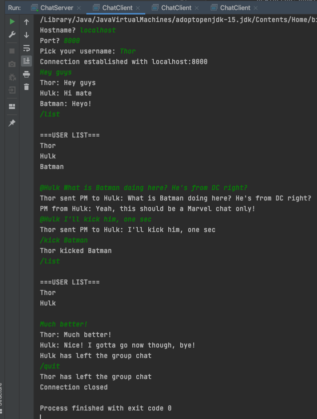

Group chat with both server and client ends built with Java7.
 
This program uses concurrency, sockets, scanners and I/O streams.
 
 
The user can do the following:
 -Join the group chat and send a message to everyone
 -Retrieve a list of all connected users from the server by typing /list
 -Send a Private Message to someone by typing @Username "message"
 -Kick someone from the group chat by typing /kick "username"
 -Leave the group chat by typing /quit
 
 
Here's an example screenshot:
 
